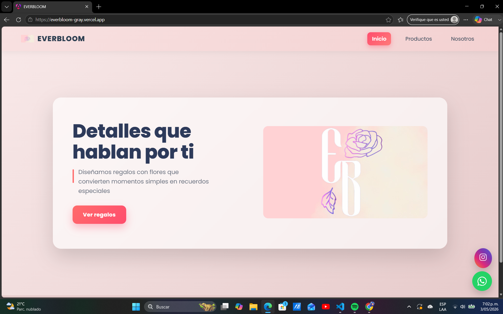
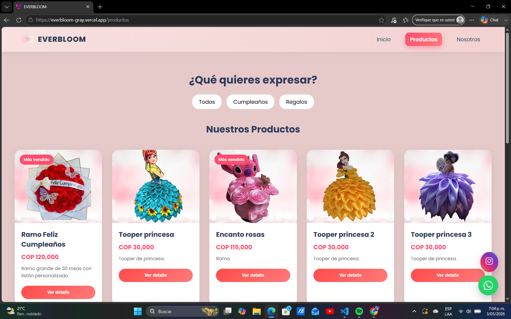
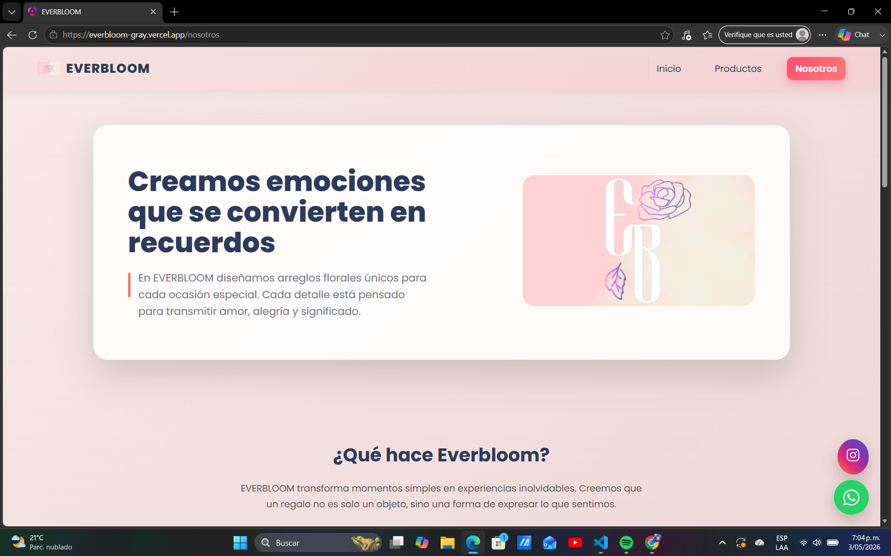

# 🌸 EVERBLOOM

Aplicación web desarrollada con Angular para una tienda de regalos florales.

-----------------------------------------------------------------------------

## Demostración en vivo
Puedes ver la página aquí:  
https://everbloom-gray.vercel.app/

-----------------------------------------------------------------------------

## Tecnologías usadas
- Angular  
- TypeScript  
- HTML  
- CSS  

-----------------------------------------------------------------------------

## Funcionalidades
- Página de inicio  
- Catálogo de productos  
- Vista de detalle de cada producto  
- Sección de contacto  
- Diseño adaptable a diferentes dispositivos  

-----------------------------------------------------------------------------

## Capturas de pantalla

### Inicio


### Productos


### Nosotros


------------------------------------------------------------------------------

## ¿Cómo ejecutar el proyecto?

Clona el repositorio:

```bash
git clone https://github.com/Juanesgogr/mi-pagina-web.git
cd mi-pagina-web
npm install
ng serve
